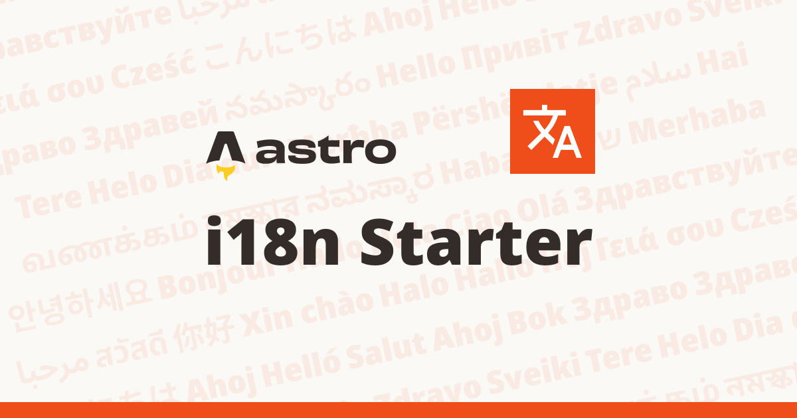

あとでGPTに英語にしてもらう

# Astro i18n Starter

```sh
npm create astro@latest -- --template astro-i18n-starter
```



i18n Starter は多言語対応サイトを作成するためのシンプルな Astro theme です。

Astro v4.0からの[i18n](https://docs.astro.build/en/guides/internationalization/)機能に対応しています。

基本的にサブディレクトリ方式のURLのみサポートしています。言語ごとに以下のようなURLで管理されます。ルートURLは指定したデフォルト言語にリダイレクトされます。

- example.com/en/
- example.com/ja/


## 特徴
- Astro公式のi18n機能をサポート
- 多言語ページの様々な管理方法
- Pure CSS
- SEOフレンドリー


## Lighthouse Score


## 設定方法・使い方
このテーマは自己文書化されており、このテーマ内の記事/投稿もドキュメントとして考えることができます。

インストールしてローカルでプレビューするか、以下のサンプルサイトをご確認ください。

https://astro-i18n-starter.pages.dev/
